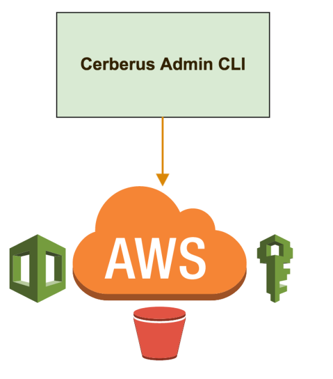

Cerberus includes a Command Line Interface (CLI) for managing Cerberus environments using CloudFormation,
native Vault APIs, and AWS API calls.
 
This command line tool includes features for: 

*  Provisioning
*  Bootstrapping
*  Maintenance
*  Recovery

It greatly simplifies managing the entire [Cerberus infrastructure](../architecture/infrastructure-overview).

Learn more about [creating a Cerberus environment](creating-an-environment) and see docs in 
the <a target="_blank" onclick="trackOutboundLink('https://github.com/Nike-Inc/cerberus-lifecycle-cli')" href="https://github.com/Nike-Inc/cerberus-lifecycle-cli">Github project</a>.

# References

*  <a target="_blank" onclick="trackOutboundLink('https://aws.amazon.com/cloudformation/')" href="https://aws.amazon.com/cloudformation/">AWS CloudFormation</a>