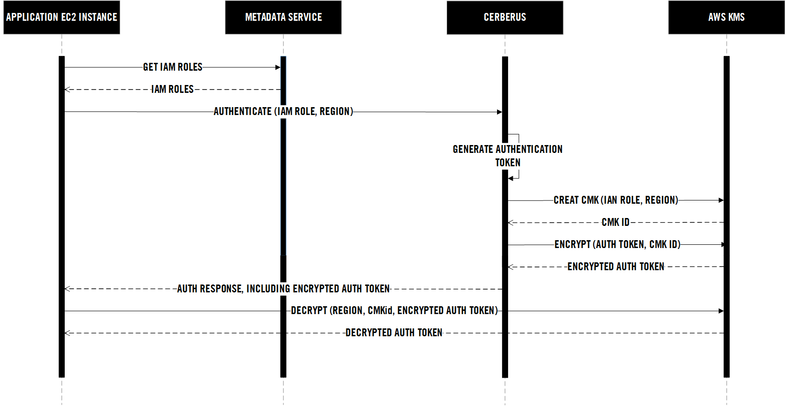
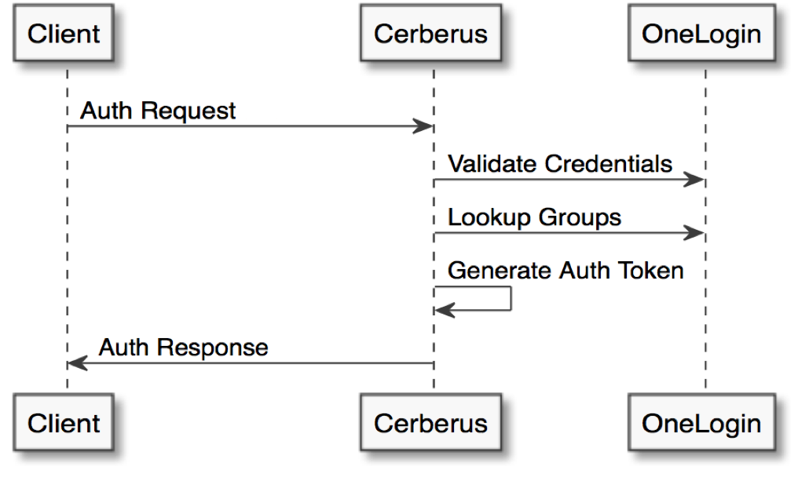

Cerberus currently supports authenticating EC2 instances, AWS Lambdas, and Users.

# EC2 Instance Authentication

One of the key components of the Cerberus offering is a simple yet secure solution for accessing privileged data from 
an EC2 instance.  Within Cerberus, the logical grouping of related data is referred to as a safe deposit box (SDB). This
SDB in a collection of metadata describing the data and a set of permissions for what LDAP groups and AWS IAM roles 
have access.

## Assumptions

If more than one IAM role is associated with the EC2 instance, the first one to authenticate successfully with Cerberus will be used.

## Prerequisites

The EC2 instance must be assigned an IAM role that has been given permissions to at least one SDB in Cerberus.
The IAM role to be assigned must contain, at a minimum, a IAM policy statement giving access to call the KMS' decrypt action.


{
    "Version": "2012-10-17",
    "Statement": [
        {
            "Sid": "Allow KMS Decrypt",
            "Effect": "Allow",
            "Action": [
                "kms:Decrypt"
            ],
            "Resource": [
                "*"
            ]
        }
    ]
}


 

## Sequence

The Cerberus Java client provides a credentials provider that is able to authenticate with Cerberus based on the 
assigned IAM roles to that instance.

1. Lookup the AWS account ID from EC2 metadata service
1. Lookup all the IAM roles assigned to the instance from EC2 metadata service
1. For each assigned IAM role:
   1. Request encrypted auth response from Cerberus
   1. Attempt to decrypt response with KMS
1. Store the [Vault token](vault) and expire time

# Lambda Authentication

Lambda authentication is similar to that of EC2 instances.  See the 
[health check lambda](https://github.com/Nike-Inc/cerberus-healthcheck-lambda) for a complete example.

# User Authentication

Cerberus supports plugging in different authentication backends.  The example below shows 
[OneLogin](https://www.onelogin.com/) but support for [Okta](https://www.okta.com/) is also being added and
others can be added easily.  LDAP groups are used to provide role-based access with either read or read/write
permissions.

# References

*  [Vault](vault)
*  [Amazon EC2 - Virtual Server Hosting](https://aws.amazon.com/ec2/)
*  [AWS Identity and Access Management (IAM)](https://aws.amazon.com/iam/)
*  [AWS Key Management Service (KMS)](https://aws.amazon.com/kms/)
*  [OneLogin](https://www.onelogin.com/)
*  [Okta](https://www.okta.com/)
