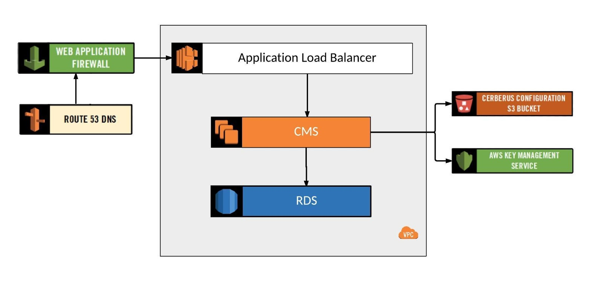

# Edge Security

Cerberus uses the Amazon WAF to provide edge security.  This is automatically setup with the 
[command-line API](../administration-guide/lifecycle-management-cli).

The WAF automatically drops requests with incorrect request body size, SQL injection, and Cross Site Scripting (XSS).

Application Load Balancer (ALB) logs are parsed using a <a target="_blank" onclick="trackOutboundLink('https://github.com/Nike-Inc/cerberus-serverless-components/tree/master/cerberus-log-processor-lambda')" href="https://github.com/Nike-Inc/cerberus-serverless-components/tree/master/cerberus-log-processor-lambda">rate limiting lambda</a> 
that automatically blacklists IP addresses exceeding a configurable request rate limit.  The access logs are stored in 
S3 and every time a new log chunk is written to S3, the Lambda is triggered (every 10 minutes or so).

For more background information, please see:

*  AWS white paper on <a target="_blank" onclick="trackOutboundLink('https://d0.awsstatic.com/whitepapers/DDoS_White_Paper_June2015.pdf')" href="https://d0.awsstatic.com/whitepapers/DDoS_White_Paper_June2015.pdf">AWS Best Practices for DDoS Resiliency</a>
*  Blog post on <a target="_blank" onclick="trackOutboundLink('https://blogs.aws.amazon.com/security/post/Tx1ZTM4DT0HRH0K/How-to-Configure-Rate-Based-Blacklisting-with-AWS-WAF-and-AWS-Lambda')" href="https://blogs.aws.amazon.com/security/post/Tx1ZTM4DT0HRH0K/How-to-Configure-Rate-Based-Blacklisting-with-AWS-WAF-and-AWS-Lambda">How to Configure Rate-Based Blacklisting with AWS WAF and AWS Lambda</a>

# Cerberus Management Service

The Cerberus Management Service is the main micro-service that makes up a Cerberus environment.  It includes features for:

*  Management of Safe Deposit Boxes
*  User Authentication
*  AWS IAM Role Authentication
*  Permissions Management

# RDS

Amazon Aurora is used as the data store.

# S3

S3 is used for storing configuration such as CMS settings and TLS certificates.

# References

*  <a target="_blank" onclick="trackOutboundLink('https://aws.amazon.com/iam/')" href="https://aws.amazon.com/iam/">AWS Identity and Access Management (IAM)</a>
*  <a target="_blank" onclick="trackOutboundLink('https://aws.amazon.com/route53/')" href="https://aws.amazon.com/route53/">AWS Route 53</a>
*  <a target="_blank" onclick="trackOutboundLink('https://aws.amazon.com/vpc/')" href="https://aws.amazon.com/vpc/">AWS Virtual Private Cloud (VPC)</a>
*  <a target="_blank" onclick="trackOutboundLink('https://aws.amazon.com/elasticloadbalancing/')" href="https://aws.amazon.com/elasticloadbalancing/">AWS Elastic Load Balancing (ELB)</a>
*  <a target="_blank" onclick="trackOutboundLink('https://aws.amazon.com/autoscaling/')" href="https://aws.amazon.com/autoscaling/">AWS Auto Scaling</a>
*  <a target="_blank" onclick="trackOutboundLink('https://aws.amazon.com/kms/')" href="https://aws.amazon.com/kms/">AWS Key Management Service (KMS)</a>
