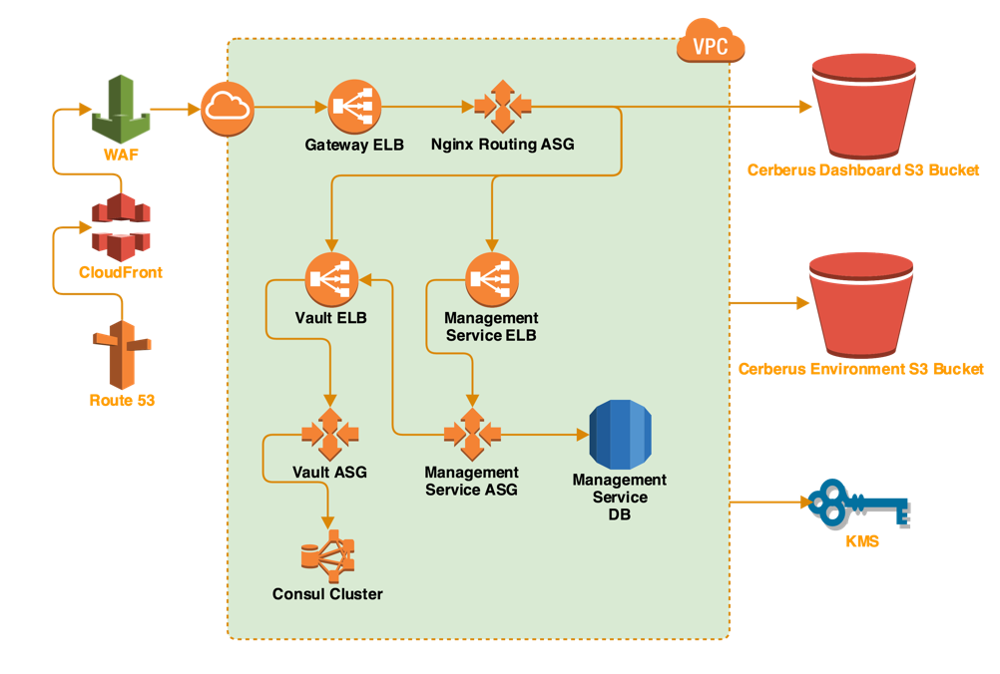
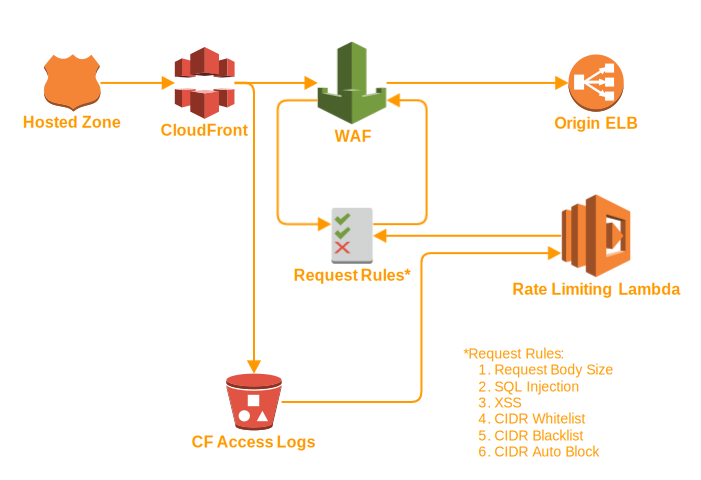
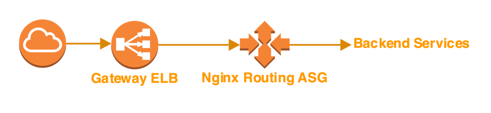
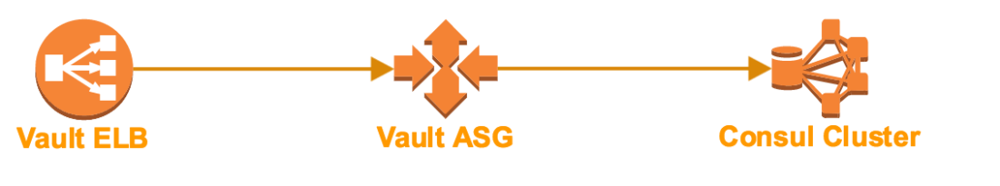
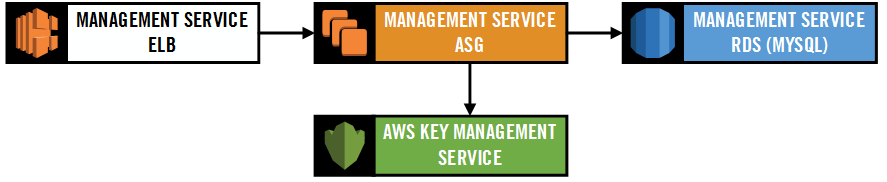

# Edge Security

Cerberus uses the CloudFront WAF to provide edge security.  This is automatically setup with the 
[command-line API](../administration-guide/lifecycle-management-cli).

The WAF automatically drops requests with incorrect request body size, SQL injection, and Cross Site Scripting (XSS).

CloudFront access logs are parsed using a <a target="_blank" onclick="trackOutboundLink('https://github.com/Nike-Inc/cerberus-cloudfront-lambda')" href="https://github.com/Nike-Inc/cerberus-cloudfront-lambda">rate limiting lambda</a> 
that automatically blacklists IP addresses exceeding a configurable request rate limit.  The access logs are stored in 
S3 and every time a new log chunk is written to S3, the Lambda is triggered (every 10 minutes or so).

For more background information, please see:

*  AWS white paper on [AWS Best Practices for DDoS Resiliency](https://d0.awsstatic.com/whitepapers/DDoS_White_Paper_June2015.pdf)
*  Blog post on [How to Configure Rate-Based Blacklisting with AWS WAF and AWS Lambda](https://blogs.aws.amazon.com/security/post/Tx1ZTM4DT0HRH0K/How-to-Configure-Rate-Based-Blacklisting-with-AWS-WAF-and-AWS-Lambda)

# Routing Requests

A Route 53 CNAME record points to the internet-facing Elastic Load Balancer (ELB) in the VPC. The ELB fronts an 
Auto Scaling Group (ASG) of <a target="_blank" onclick="trackOutboundLink('https://www.nginx.com/')" href="https://www.nginx.com/">NGINX</a> instances and handles reverse proxying of the 
[Cerberus Dashboard](../user-guide/dashboard), [Vault](vault), and the Cerberus Management Service. Only APIs from Vault that are 
required for managing secrets are exposed.

# Vault and Consul

Consul is the underlying storage for [Vault](vault).

# Cerberus Management Service

The Cerberus Management Service is a microservice that was created to add needed features without modifying the 
Vault project including:

*  Management of Safe Deposit Boxes
*  User Authentication
*  AWS IAM Role Authentication
*  Permissions Management

# References

*  <a target="_blank" onclick="trackOutboundLink('https://aws.amazon.com/cloudfront/')" href="https://aws.amazon.com/cloudfront/">AWS CloudFront</a>
*  [AWS Identity and Access Management (IAM)](https://aws.amazon.com/iam/)
*  <a target="_blank" onclick="trackOutboundLink('https://aws.amazon.com/route53/')" href="https://aws.amazon.com/route53/">AWS Route 53</a>
*  [AWS Virtual Private Cloud (VPC)](https://aws.amazon.com/vpc/)
*  [AWS Elastic Load Balancing (ELB)](https://aws.amazon.com/elasticloadbalancing/)
*  <a target="_blank" onclick="trackOutboundLink('https://aws.amazon.com/autoscaling/')" href="https://aws.amazon.com/autoscaling/">AWS Auto Scaling</a>
*  [AWS Key Management Service (KMS)](https://aws.amazon.com/kms/)
*  <a target="_blank" onclick="trackOutboundLink('https://www.nginx.com/')" href="https://www.nginx.com/">NGINX</a>