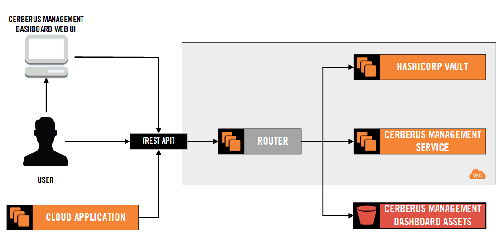

Cerberus is a composed API behind a reverse proxy that delegates to 3 services.

* `/dashboard*` goes to the S3 bucket and serves our [Dashboard](../user-guide/dashboard), a
  [React](https://facebook.github.io/react/) single-page application (SPA), that provides the UI for interacting with the other two services.
* `/v1/secret/*` goes to the [Vault generic secret backend](https://www.vaultproject.io/docs/secrets/generic/index.html).
* `/v1/auth/token/lookup-self` goes to the [Vault auth backend](https://www.vaultproject.io/docs/auth/token.html).
* `/v1/*` (everything else) goes to [Cerberus Management Service API](https://github.com/Nike-Inc/cerberus-management-service/API.md)
  * The other key thing to note is that when you post to `/v1/auth/iam-role` the JSON payload you get back is an 
    encrypted KMS blob that requires 
    a [decrypt call](http://docs.aws.amazon.com/kms/latest/developerguide/programming-encryption.html) to get the actual
    JSON payload defined in the [API](https://github.com/Nike-Inc/cerberus-management-service/API.md).  See the 
    [health check lambda](https://github.com/Nike-Inc/cerberus-healthcheck-lambda) for simple example code.

Please see the documentation for the underlying API you wish to work with.
    

# References

*  [KMS API Reference](http://docs.aws.amazon.com/kms/latest/APIReference/Welcome.html)
*  [KMS Programming Guide](http://docs.aws.amazon.com/kms/latest/developerguide/programming-top.html)