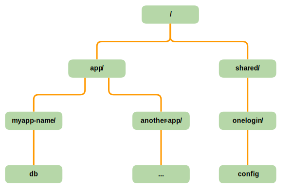
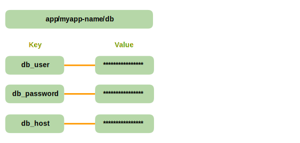
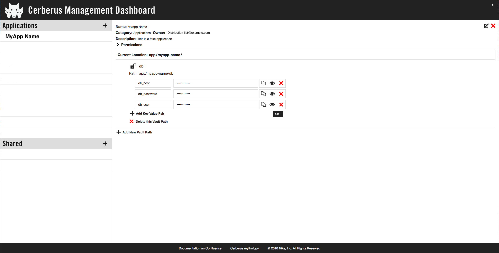

<a target="_blank" onclick="trackOutboundLink('https://www.vaultproject.io/')" href="https://www.vaultproject.io/">Vault</a> is a tool created by <a target="_blank" onclick="trackOutboundLink('https://www.hashicorp.com/')" href="https://www.hashicorp.com/">Hashicorp</a> for managing 
secrets. Cerberus uses Vault for storage and securing access to data.

Consul is a tool for service discovery, monitoring and configuration. In Cerberus, Consul is the storage backend for 
Vault and provides high availability.

# Safe Deposit Box (SDB)

Cerberus adds a higher level safe deposit box (SDB) abstraction on top of Vault.  SDBs provide metadata including 
descriptions, permissions, Vault policies, and the path within Vault where that data will be written and read. Access
is controlled by giving read or read/write permissions to IAM roles and/or LDAP groups.

# Vault Tokens

Vault tokens (e.g. 9cfced14-91ae-e3ad-5b9d-1cae6c82362d) are the core method for [authentication](authentication). Authentication 
backends can be used to dynamically generate tokens based on external identities. Tokens bind to a list of Vault 
policies and are immutable.

# Vault Tree

Data in Vault is organized as a tree.

Cerberus has two main nodes at the top of the tree:

1. Applications - SDBs for individual applications
2. Shared - SDBs for secrets that are shared more widely between applications or teams

This is a semantic distinction that is also displayed in the UI but there is no practical difference in terms of functionality.
Permissions and access controls work the same for both categories.

In the diagram below, 'myapp-name' and 'another-app' are two different cloud applications and the 'onelogin' SDB
is used for properties that need to be shared between many applications.  The leaf nodes 'db' and 'config'
are arbitrary names used to further organize application or shared secrets.  An individual application might have one
leaf node under it or several.

# Vault Node

At any particular node a set of key/value properties can be stored.

The Cerberus [dashboard](../user-guide/dashboard) provides users a UI to modify these properties.  For example, the 
screenshot below corresponds with the Vault node above.

# References

* <a target="_blank" onclick="trackOutboundLink('https://www.vaultproject.io/docs/index.html')" href="https://www.vaultproject.io/docs/index.html">Vault Documentation</a>
* <a target="_blank" onclick="trackOutboundLink('https://www.vaultproject.io/docs/concepts/tokens.html')" href="https://www.vaultproject.io/docs/concepts/tokens.html">Vault Tokens</a>
* <a target="_blank" onclick="trackOutboundLink('https://github.com/hashicorp/vault')" href="https://github.com/hashicorp/vault">Vault Github</a>
* <a target="_blank" onclick="trackOutboundLink('https://www.consul.io/docs/index.html')" href="https://www.consul.io/docs/index.html">Consul Documentation</a>
* <a target="_blank" onclick="trackOutboundLink('https://github.com/hashicorp/consul')" href="https://github.com/hashicorp/consul">Consul Github</a>