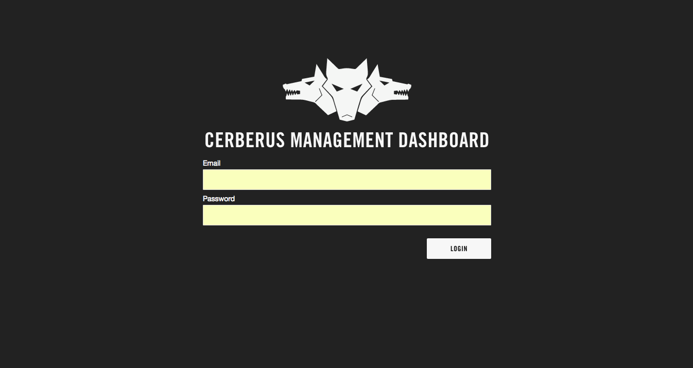
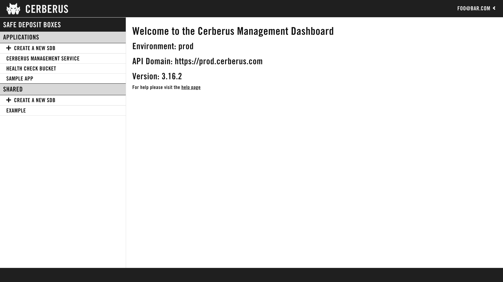
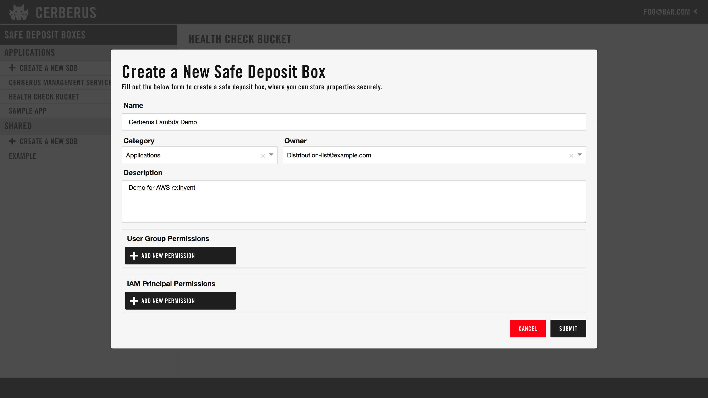
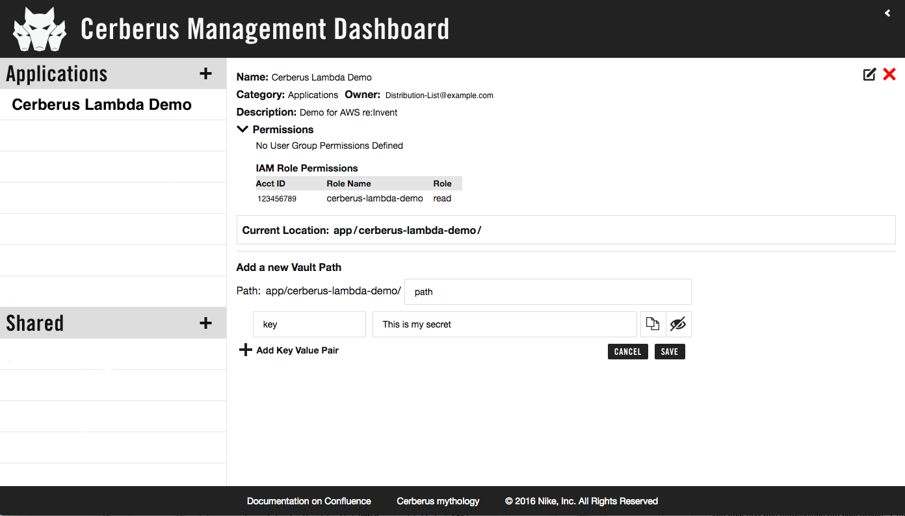
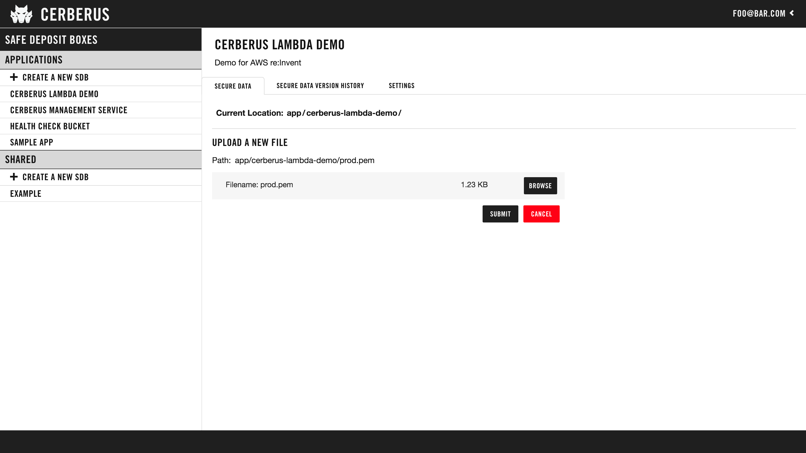
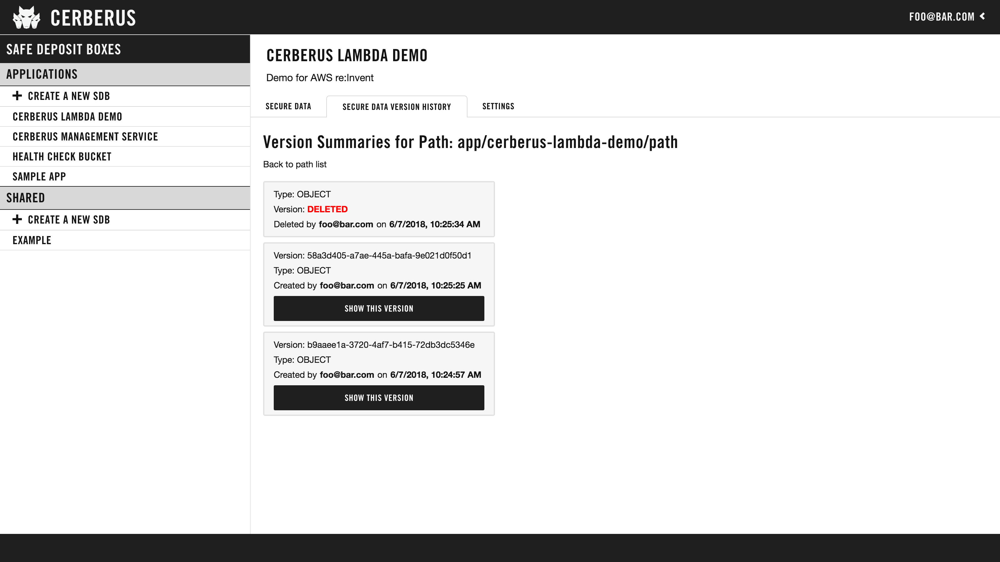
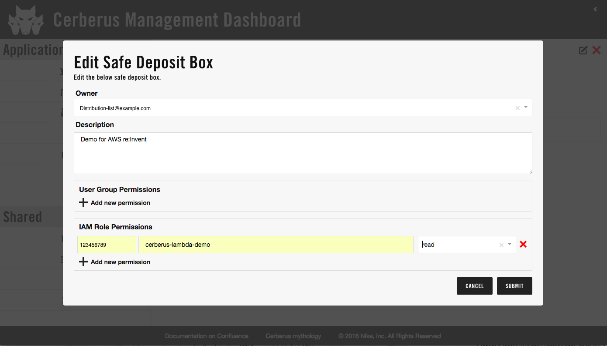

The Cerberus Dashboard is a Self-Service UI for managing secrets.

The data model is centered around the concept of Safe Deposit Box (SDB).
Basically, an SDB is a safe place to put secrets.  The user creates SDBs and decides 
what users and IAM roles should have access to the data.  

The Dashboard lets users:

- Create new safe deposit boxes (SDB) for Applications or Shared secrets
- Modify ownership and access permissions for secrets
- Delete SDBs

Three levels of access are supported:

- Read
- Read/write
- Owner - read/write plus management of SDB permissions and description

Admins do not have direct access to the secret data but can view the SDB meta-data.

# Screenshots

Single sign-on eliminates the need to manually create user accounts.

 

The Welcome Screen lists the SDBs you have access to and lets you add new ones.

 

Users can create their own safe deposit boxes for their applications.  Self-service eliminates the need for 
service tickets to administrators.

 

Users can add paths for their applications as well as view and modify properties and files.

 

 

Users can view the versions of paths and their values.

 

Editing a Safe Deposit Box (SDB) allows users to add and remove permissions.

Only the owner is allowed to modify permissions or to delete the SDB.

 

# Implementation

The dashboard is implemented as a <a target="_blank" onclick="trackOutboundLink('https://facebook.github.io/react/')" href="https://facebook.github.io/react/">React</a> single-page application (SPA) that interacts with the
[REST API](../architecture/rest-api).

# References

*  <a target="_blank" onclick="trackOutboundLink('https://github.com/Nike-Inc/cerberus-management-service/tree/master/dashboard')" href="https://github.com/Nike-Inc/cerberus-management-service/tree/master/dashboard">Cerberus Management Dashboard Github</a>
*  <a target="_blank" onclick="trackOutboundLink('https://facebook.github.io/react/')" href="https://facebook.github.io/react/">React JavaScript Library</a>
